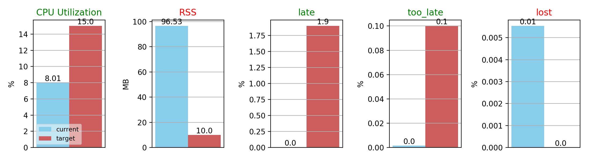
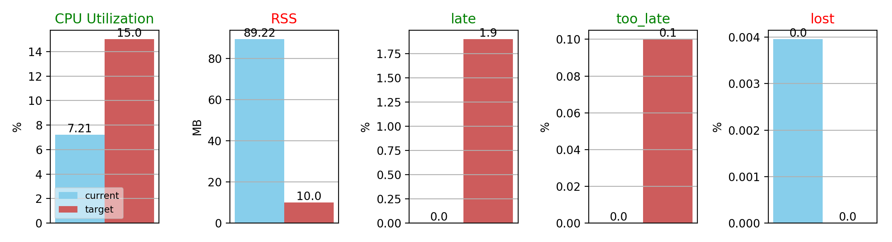

Running `sierra_nevada` with the following qos settings: 

```
rmw_qos_profile_t custom_qos_profile = rmw_qos_profile_default;
custom_qos_profile.history = rmw_qos_history_policy_t::RMW_QOS_POLICY_HISTORY_KEEP_LAST;
custom_qos_profile.depth = 1;
custom_qos_profile.reliability = rmw_qos_reliability_policy_t::RMW_QOS_POLICY_RELIABILITY_RELIABLE;
custom_qos_profile.durability = rmw_qos_durability_policy_t::RMW_QOS_POLICY_DURABILITY_VOLATILE;
custom_qos_profile.avoid_ros_namespace_conventions = false;
```

## IPC on 

## IPC OFF


